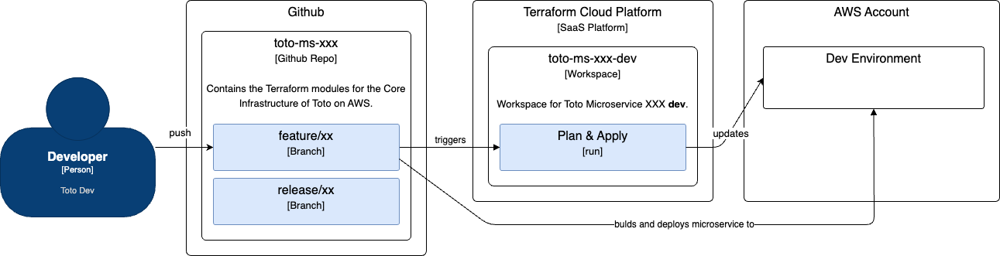

# AWS Environment Management and Toto Deployment on AWS
[Go back to the Main Page](../../../README.md)

## Index
* [1. Overall Pattern](#1-overall-pattern)
    * [1.1. Core Infrastructure Flow](#11-core-infrastructure-flow)
    * [1.2. Microservice Flow](#12-microservice-flow)

 

## 1. Overall Pattern

Toto manages two different CI/CD and IaC flows: 
1. **Core Infrastructure Flow**. This flow is managed through the `toto-terra-aws` Github Repository and is responsible of creating the **core infrastructure**.  
By *core infrastructure* we mean all static infrastructure that is needed to run Toto and **does not depend from a given Microservice**.  
Some examples are: VPC networks, Subnets, Load Balancer, ECS Clusters. 

2. **Microservice Flow**. This flow is managed through each Microservice's Github Repository and is reponsible for **CI/CD of the Microservice** and for the **deployment of Microservice-dependent infrastructure**. 
By *microservice-dependent infrastructure* we mean infrastructure that would not exist if the microservice was not there.  
Some examples are: Load Balancer Listener's route, ECS Task Definition, ECS Service.

The following diagram represents ths overview. 

 

An **important aspect** of the split between these two flows, is that the *Microservice Flow* Terraform modules will require **information from the Core Infrastructure Flow**.  
For example, things like Roles, Subnet IDs, VPC Id, Security Groups need to be used when creating Microservice-specific resources (like ECS Task Definition, which requires ECS Task Role and Task Execution Role, or ECS Service, which requires the Subnets on which to run). 
To avoid duplicating information across Terraform files, the *Core Infrastructure Flow* has the **responsibility to create Github Action Secrets** for each Microservice, that contain these common components' IDs.

As a consequence of these two flows and how they are organized, when creating and deploying Toto Infrastructure and microservices, one needs to first: 
1. Run the *Core Infrastructure Flow*. That will create the Infrastructure foundation on top of which the Microservices will be hosted **and the secrets that the Microservice's Terraform configuration needs**. 
2. Run the *Microservice Flow*. That will build the Microservice, deploy its microservice-specific infrastructure and deploy the Microservice.

### 1.1. Core Infrastructure Flow

When a Developer pushes a change to the `toto-terra-aws` repo, based on the branch that the changes are pushed to, this triggers an automated *Terraform Apply*, that will apply the changes on the AWS infrastructure. The environment that gets changed depends on the Github Repo branch that the change was pushed to. The following diagram shows this flow.  

 

In Terraform, there is **one workspace per environment**.  
That workspace is configured as to **automatically react** to a **push** on the given branch and **automatically run** both Plan and Apply when the push is detected. 

### 1.2. Microservice Flow

When a Developer pushes a change to a Microservice's Github Repo, the following happens, as shown in the below diagram: 
1. Github Action will **build the Microservice** and store the image on ECR.
2. Github Action will **trigger a Terraform Apply** to make any needed changes to the AWS Infrastructure (strictly related to this Microservice).
3. Github Action will **deploy** the Microservice. This is, in reality, done as part of step 2, since the deployment happens by updating the Task Definition with the new Container Image. 

 

