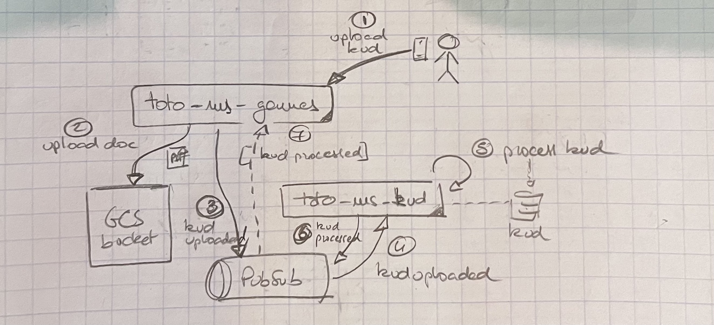

# Kud Upload

This process describes the upload of a DanskeBank kontoudskrift "kud" PDF and subsequent extraction of all the incomes and payments contained in the document. 

The steps are the following: 

1. The user **uploads a KUD through** (in this case) `toto-ms-games`.  
That means, in this case, that there is a "Toto Payments Game" that allows the user to upload a KUD. 

2. The service uploads the document on a **GCS bucket** dedicated to games 

3. The service then **publishes a `kudUploaded` event** on PubSub

4. The event gets **read by `toto-ms-kud`**.  
The service has the responsibility to manage kud documents.  

5. The service **processes the kud** and stores it both as a PDF and as structured **data in a DB**. 

6. The service **publishes a `kud-processed` event** on PubSub. 

