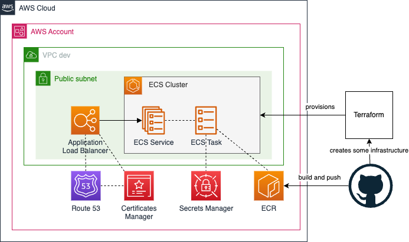

# Toto Microservice Architecture on AWS with ECS
[Go back to the Main Page](../../README.md)

There can be multiple architectures for Toto on AWS. This guide focuses on the **ECS-based Architecture**. 

## Index
* [1. Components of the Architecture](#1-components-of-the-architecture)
* [2. Exposing and Reaching a Toto Microservice](#2-exposing-and-reaching-a-toto-microservice)
 
 

The following is the overall ECS-based Architecture used by Toto on AWS. 
Note that all the Architecture is provisioned by Terraform. You can find all the related guides and documentation on the [AWS Toto Terraform setup page](../infra-cicd/aws/aws.md).

## 1. Components of the Architecture
### AWS Account
There is only a single AWS Account being used **for all environments** of Toto. 

### Networking
The VPC **is per Environment** so there are one dev and one prod VPCs. Each VPC has **two public subnets**. The diagram shows only one logical subnet, but **there are 2**, in two different **availability zones**. 
This was required to work with a Load Balancer (apparently).

### Load Balancing & Route 53
Toto Microservices are exposed by an ALB. The ALB provides an **HTTPS Listener**.  
The ALB Listener has **multiple rules**, one for each Microservice. Each rule points to a *Target Group* that points to the Microservice.

Route 53 holds the Toto domain and the DNS settings. 

The Certificates Manager is where the Certificate to use for TLS are requested and stored. Only one certificate is created for all Toto domains and subdomains.  
Toto has the following Fully Qualified Domain Names explicitly mentioned in the Certificate: 
* The root domain (e.g. `to7o.com`)
* Subdomains for APIs (with environment): `api.<env>.toto.aws.<root domain>` (e.g. `api.dev.toto.aws.to7o.com`)

Route 53 contains the DNS settings used for the Certificate validation.

The Certificate is then linked to the Load Balancer, to support HTTPS endpoints.

### Secrets 
All Toto Secrets are stored in Secrets Manager.

### ECS & ECR
A Toto Microservice, in this Architecture, is deployed on ECS.  
There is **one ECS Cluster** per environment. 

That means that **for each Microservice**, you will have:
* A *Task Definition* for that Microservice, that takes a specific image on ECR
* A *Service* for that Microservice, that deploys a *Task* on an ECS Cluster.

The flow to deploy a Microservice is well described [in the CI/CD Guide](../infra-cicd/aws/aws.md).

## 2. Exposing and Reaching a Toto Microservice
Once a Microservice is deployed, there will thus be:
* A *HTTPS Listener* that has a rule that points to a *Target Group*.
* The *Target Group* that points to the *ECS Service*.

The *Listener Rule* is **important**: to route to the right *Target Group*, the rule looks at the **HTTP Header** called `toto-service` and based on the value of that header, will route to the Microservice. 
The value of the `toto-service` HTTP Header must be the full name of the microservice (e.g. `toto-ms-expenses`).

To deploy a new Microservice, check the [Guide: Creating and Deploying a new Microservice in Toto AWS ECS Architecture](./new-ms-aws-ecs.md).